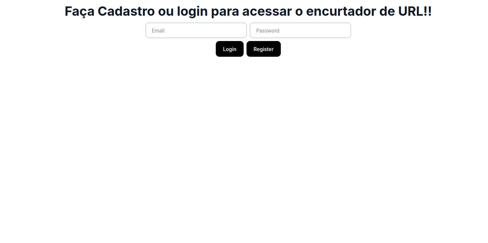
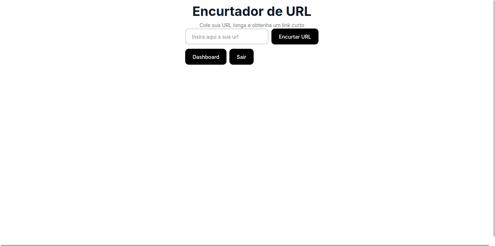
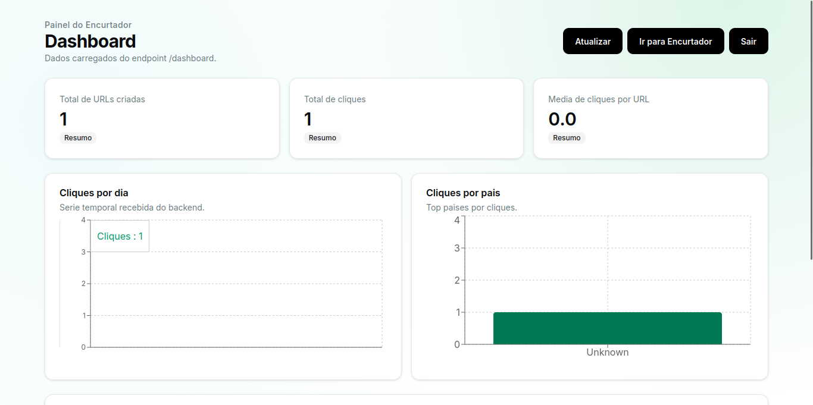

## Safe URL Shorter

A full-stack URL shortener with **strong focus on security**. Built as a study project to learn about web security and pratice modern full-stack development.

**Frontend**: React
**Backend**: Node.js + Express + MongoDB + Redis

The application allows registered users to create short URLs that redirect to original long URLs. It includes features such as user authentication, URL management, analytics, and security measures to protect against common web vulnerabilities.

## Main Features
- User registration and login
- URL shortening with unique codes
- **Security verification in two layers**:
  - Google Safe Browsing API (detection of phishing, malware, etc.)
  - Cloudflare 1.1.1.3 (family filter – blocks adult and unwanted content)
- Personal statistics dashboard (clicks, accesses, etc.)
- Redis cache for better performance
- Complete monitoring with Prometheus + Grafana
- Containerization with Docker Compose

## Frontend (React)

The frontend was intentionally kept **simple and functional** to focus on backend integration:

- **Login/Register Screen**: Clean forms with email and password fields.
- **Main Screen**: Input field to paste the Long URL + "Encurtar URL" button. Displays the generated short link and real-time security feedback (URL safe or blocked).
- **Dashboard**: Shows a list of created short URLs with click statistics.

The design is minimalistic, responsive and priozitizes usability and clarity.

### Frontend Screenshots

  
*Login and registration page*

  
*URL shortening form*

  
*Personal dashboard with statistics*

## Technnologies Used

**Frontend**: React (with Vite), Typescript, Tailwind CSS, shadcn/ui components and React Router.

**Backend**: Node.js, Express, MongoDB (Mongoose), Redis and Vitest for development.

**Security & DevOps**: Google Safe Browsing API, Cloudflare 1.1.1.3, Prometheus, Grafana and Docker Compose

## Running the Application

1. Clone the repository:
   ```bash
   git clone <repository-url>
   ```
2. Navigate to the project directory:
   ```bash
   cd url-shorter-mern
   ```
3. Start the application using Docker Compose:
   ```bash
   docker-compose up --build -d
   ```
4. Access the frontend at `http://localhost:5173` and the Grafana dashboard at `http://localhost:3333`.

Don't forget to set up the required environment variables for the backend (MongoDB URI, Redis URI, Google Safe Browsing API key, etc.) in the `.env` files.

## Security Measures
- **Google Safe Browsing API**: Every URL submitted for shortening is checked against Google's database of unsafe URLs. If the URL is flagged as malicious (phishing, malware, etc.), the user receives an immediate warning and the URL is not shortened.
- **Cloudflare 1.1.1.3**: This DNS resolver with family filtering is used to block access to adult and unwanted content. If a URL is categorized as inappropriate (the server can't ping it), the user is notified and the URL is rejected.
- **Input Validation**: All user inputs are validated and sanitized to prevent injection attacks.
- **Authentication**: User authentication is implemented securely with hashed passwords and JWT tokens.
- **Rate Limiting**: To prevent abuse, rate limiting is applied to API endpoints.

## Learning Outcomes
- Kept the frontend simple to focus on backend development ,security integration and DevOps practices.
- Gained hands-on experience with Google API's.
- Used Redis for caching and improving performance.
- Implemented security checks in two layers to ensure the safety of shortened URLs.

Important note: This project is intended for study purposes. It's not deployed publicly because it is a URL shortener, which can be easily abused if not properly monitored and maintained.